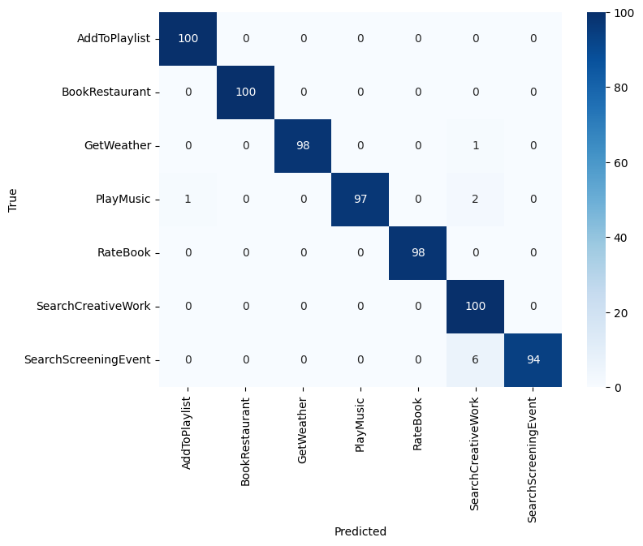

# **Building Practical Intent Classification and NER Pipelines on the SNIPS Dataset**

This project implements practical, well-structured NLP pipelines on the **SNIPS 2018 Spoken Language Understanding dataset**, focusing on two tasks, `Intent Classification` and `Slot Filling (NER)`.

# ⭐ **Results Summary**

* **Completed full SLU pipeline for SNIPS:** intent classification + slot filling
* **BERT-based Intent Classifier:** 98.56% accuracy
* **DistilBERT-based NER:** 94.5% entity-level F1
* **Few-shot performance:** ~97.8% accuracy with ~70 samples per intent
* **Includes:** preprocessing, leakage-safe dataset splits, tokenizer setup, training loops, evaluation, and error analysis.

# **Dataset Citation**

> Coucke A. et al., “Snips Voice Platform: an embedded spoken language understanding system for private-by-design voice interfaces.” 2018.
> [https://arxiv.org/abs/1805.10190](https://arxiv.org/abs/1805.10190)

# **Dataset Overview**

The SNIPS dataset contains user utterances annotated for two SLU tasks:

### **1. Intent Classification**

* 7 intent labels
* Well-Balanced
* Each utterance has exactly one intent
  (e.g., `BookRestaurant`, `SearchCreativeWork`, `PlayMusic`, etc.)

### **2. Slot Filling (NER)**

Utterances contain entity spans such as:

* `object_type`
* `artist`
* `genre`
* `country`
* `poi_type`
* etc.

Entity frequencies are **very imbalanced** (e.g., `object_type`: 3341 vs `genre`: 147), which heavily influences NER difficulty.


# **PART I — Intent Classification**

## **1. Summary**

This section covers the **intent classification pipeline** using **BERT-base**, evaluated under:

* **Few-shot settings:** 10, 20, 50, 70, 100 samples per intent
* **Full-data setting**

All experiments use the **cleaned, leakage-free** dataset.

**Top-level results :**

* **98.56% accuracy** on the full dataset
* **97.84% accuracy** with only 100 samples/intent
* Detailed shot-by-shot table below


## **2. Data Cleaning & Preprocessing**

The intent preprocessing pipeline includes:

* Whitespace normalization
* Stratified train–validation split (preserves label distribution)
* Deduplication within each split
* Strict removal of cross-split leakage (train ↔ val ↔ test)
* Consistent text formatting across all few-shot and full-data settings

This ensures clean, balanced, leakage-free evaluation across all experiments.
## **3. Modeling Approach**

* **Model:** BERT-base (fine-tuned end-to-end)
* **Head:** Single linear classification layer on `[CLS]`
* **Training:** Cross-entropy loss, AdamW optimizer, linear LR scheduler with warmup, early stopping (patience = 3)
* **Validation:** Best model selected using validation weighted F1
* **Inputs:** Cleaned, tokenized utterances (max length = 44)
* **Evaluation:** Accuracy, weighted F1, confusion matrix, error analysis


## **4. Results**

| Training Size | Accuracy | Weighted F1 | Errors (out of 697) |
| - | -- | -- | - |
| **10-shot**   | 82.21%   | 81.13%      | 124                 |
| **20-shot**   | 95.69%   | 95.66%      | 30                  |
| **50-shot**   | 96.70%   | 96.72%      | 23                  |
| **70-shot**   | 97.84%   | 97.86%      | 15                  |
| **100-shot**  | 97.84%   | 97.86%      | 15                  |
| **Full**      | 98.56%   | 98.57%      | 10                  |

### **Confusion Matrix of the Full Training Size Model**



### **Observations**

* Strong scaling with labeled data, diminishing returns after ~70 examples per intent.
* Remaining errors mostly come from semantically close intent pairs:

  * *SearchCreativeWork* ↔ *SearchScreeningEvent*
* A small set of utterances is genuinely ambiguous/underspecified.


# **PART II — Slot Filling (NER)**

## **1. Summary**

This section implements the **slot filling (entity recognition)** pipeline using BERT-base with BIO tagging.

Core focus:

* Correct subword → label alignment
* Clean handling of tokenization drift
* Reliable entity-level evaluation

**NER Result (entity-level F1):**
**94.54%**


## **2. Data Cleaning & Preprocessing (NER)**

The NER preprocessing pipeline includes:

* Reconstructing full utterances from SNIPS JSON files
* Extracting character-level entity spans from the original annotations
* Performing whitespace-based tokenization
* Converting entity spans into **BIO word-level tags**
* Applying a stratified train–validation split by intent
* Ensuring consistent formatting across train/validation/test sets

This creates clean word-level BIO labels ready for subword alignment during tokenization.


## **3. Modeling**

* **Model:** DistilBERT (fine-tuned end-to-end)  
* **Head:** Token-classification layer over subword tokens  
* **Labeling scheme:** BIO tags aligned to subword tokens  
* **Training:** AdamW optimizer, linear LR scheduler, warmup, early stopping  
* **Masking:** `-100` used to ignore special and padded tokens  
* **Evaluation:** Entity-level F1 using `seqeval`, with token-level accuracy as an auxiliary metric

Training, subword alignment, and evaluation are implemented directly in the notebook using HuggingFace's `Trainer`.


## **4. Results**

* **Entity-level F1:** **94.54%**

Entity-type variability is substantial due to frequency imbalance:

* High-frequency entities (e.g., `object_type`) → very strong F1
* Sparse entities (e.g., `genre`) → lower stability in few-shot conditions

Detailed per-entity breakdown and analysis are available in the notebook.


# **How to Use This Repository**

1. **Install dependencies**

```bash
pip install -r requirements.txt
```

2. **Run the Intent Classification pipeline**

Execute notebooks **in order**:

```
01_build_snips_intent_dataset.ipynb  
02_preprocessing_intent.ipynb  
03_eda_intent.ipynb  
04_train_and_evaluate_full_intent.ipynb  
05_evaluate_intent.ipynb  
06_prototype_intent.ipynb
```

This builds the intent dataset, preprocesses it, trains the model (few-shot + full), evaluates it, and produces the confusion matrix.

3. **Run the NER pipeline**

Execute notebooks **in order**:

```
07_build_snips_ner_dataset.ipynb  
08_train_and_evaluate_full_ner.ipynb  
09_evaluate_ner.ipynb  
10_prototype_ner.ipynb
```

This constructs the NER dataset (BIO word-level), aligns labels to subwords, trains DistilBERT, and evaluates using entity-level F1.
